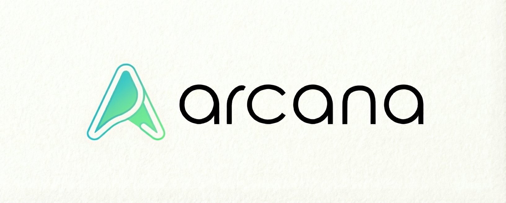

<p align="center">
  
</p>

<h1 align="center">@arcanalabs/ui-components</h1>

<p align="center">
  A typed, shadcn-style component library — <b>51 components</b>, native for
  <b>Vue 3</b>, <b>React</b>, <b>Angular</b> and <b>Svelte 5</b>,
  sharing one framework-agnostic stylesheet.
</p>

<p align="center">
  <a href="https://arcana-labs-org.github.io/ui-components/"><b>📖 Documentation &amp; live demos</b></a>
</p>

---

## Install

```bash
npm install @arcanalabs/ui-components
```

**No runtime dependencies** — installing the package adds nothing to your bundle.

## Set up

Import the stylesheet once, at the entrypoint of your application:

```ts
import "@arcanalabs/ui-components/styles.css";
```

Then import components from the subpath of your framework:

| Framework | Subpath |
|---|---|
| Vue 3 | `@arcanalabs/ui-components/vue` |
| React | `@arcanalabs/ui-components/react` |
| Angular | `@arcanalabs/ui-components/angular` |
| Svelte 5 | `@arcanalabs/ui-components/svelte` |

Every component ships in all four with the same markup, classes and behavior.

## Optional peers

Each of these is an **optional peer dependency**: install it only if it applies to
you. Nothing fails at install time when one is missing — the component that needs
it is the one that requires it.

**Your framework** — install only the one you use (`vue`, `react` + `react-dom`,
`@angular/core` + `@angular/common`, or `svelte`).

**Icons** — components with an `icon` prop use the Font Awesome Free classes
(`fa-solid fa-*`):

```bash
npm install @fortawesome/fontawesome-free
```

```ts
import "@fortawesome/fontawesome-free/css/all.min.css";
```

**Input masking** — `ArcanaInputMask` masks through
[`maska`](https://github.com/beholdr/maska), in all four frameworks:

```bash
npm install maska
```

In Vue only, register the directive once when you create the app:

```ts
app.use(Maska);
```

## Usage

The full catalog — components, props, events, live demos and per-framework code —
lives in the **[documentation](https://arcana-labs-org.github.io/ui-components/)**,
available in 8 languages.

MIT © Arcana Labs
